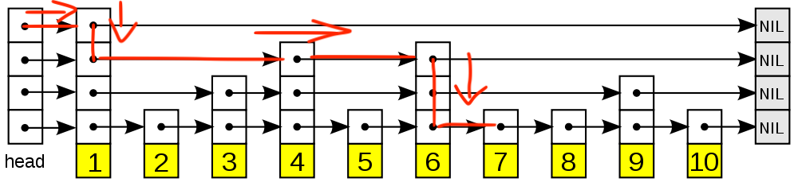

> 本篇讲述 `Redis` 中的基础数据结构 `ZSet`(`SortedSet`) 的底层实现原理和如何通过 go 语言实现一个 `ZSet` 的过程以及需要注意的问题。

<!--more-->


本文章为该系列的`有序集合`，如果需要阅读其他相关文章， 请点击[这里](https://yusank.github.io/posts/redeis-server-introduction/)跳转查看


## 1 前言

使用 Redis 过程中集合这个概念出现的比较频繁，常用的 `set`，`zset` 都是集合的概念。与普通的集合不同的是，`zset` 的元素之间是有顺序的，而且这个顺序不是插入的顺序而是使用者插入元素时指定的 score 而定的。

`zset` 中的任何元素都是有score 值（浮点数）的，而且根据 score 的顺序进行读写甚至可以做到获取范围数据，这些特性给使用者带来了无数种可能性解决方案。


从使用者的角度来说，zset 更像一个 kv 结构,元素不可以重复但是不同元素的 score 值是可以一样的，此时的排序是按元素字典排序。

通过 `ZRANGEBYSCORE` 命令可以列出指定score范围内的元素以及对应的 key，
其顺序为 score 的升序。

```shell
> ZRANGEBYSCORE zset1 0 100 withscores
1) "a"
2) "5"
3) "b"
4) "5"
5) "hello"
6) "20"
```



## 2 zset 支持的能力

`zset` 作为一个有序集合，即拥有普通集合的特性，同时又基于其有序特性衍生出更多别的特性。主要特性如下：

- 元素不重复
- 集合之间交集并集差集的操作
- 批量读写元素
- 根据 score 操作（增删改查）元素
- 获取score最大最小的元素
- 根据集合内rank（或 index）操作（增删改查）元素

## 3 zset 底层原理


本篇中所有引用的 Redis 源码均基于 `Redis6.2` 版本。


Redis 实现的 `zset` 底层是跳跃表和哈希表的组合。`跳跃表` 用于记录和操作所有基于 score 的操作，而`哈希表`存的是元素值和 score 的kv关系，用于快速定位元素存不存在的情况。

```c
typedef struct zset {
    dict *dict; // 哈希表，存储 元素->score
    zskiplist *zsl; // 跳跃表
} zset;
```

除了跳跃表和哈希表之外，其实还有一个不怎么出场的数据结构 -- `ziplist`（压缩列表）。在满足以下两个条件的情况下，Redis 会使用 `ziplist`来替代跳跃表。

1. 保存的元素少于128个
2. 保存的所有元素大小都小于64字节

在了解跳跃表之前先了简单解一下 `ziplist` 这个数据结构的实现以及解答为什么要用 `ziplist` 来替代跳跃表。

### 3.1 压缩列表-ziplist

ziplist 编码的有序集合对象使用压缩列表作为底层实现，每个集合元素使用两个紧挨在一起的压缩列表节点来保存，第一个节点保存元素的成员，第二个节点保存元素的分值。并且压缩列表内的集合元素按分值从小到大的顺序进行排列。

从上述的两个条件可以看出，在数据量少且单个元素也比较小的情况下，使用 ziplist 是为了节省内存，因为在数据量少的情况下发挥不出来 skiplist 的优势且占的内存比 ziplist 大。

想更深入了解 ziplist 的实现细节，请[点击](https://redisbook.readthedocs.io/en/latest/compress-datastruct/ziplist.html)这里查看



- ziplist 结构分布

```markdown
area        |<---- ziplist header ---->|<----------- entries ------------->|<-end->|

size          4 bytes  4 bytes  2 bytes    ?        ?        ?        ?     1 byte
            +---------+--------+-------+--------+--------+--------+--------+-------+
component   | zlbytes | zltail | zllen | entry1 | entry2 |  ...   | entryN | zlend |
            +---------+--------+-------+--------+--------+--------+--------+-------+
                                       ^                          ^        ^
address                                |                          |        |
                                ZIPLIST_ENTRY_HEAD                |   ZIPLIST_ENTRY_END
                                                                  |
                                                         ZIPLIST_ENTRY_TAIL
```

- ziplist 节点结构分布

```markdown
area        |<------------------- entry -------------------->|

            +------------------+----------+--------+---------+
component   | pre_entry_length | encoding | length | content |
            +------------------+----------+--------+---------+
```



### 3.2 跳跃表-skiplist

#### 3.2.1 定义

跳跃表是一个随机化的数据结构，实质就是一种可以进行二分查找的有序链表。跳跃表在原有的有序链表上面增加了多级索引，通过索引来实现快速查找。跳跃表不仅能提高搜索性能，同时也可以提高插入和删除操作的性能。

它采用随机技术决定链表中哪些节点应增加向前指针以及在该节点中应增加多少个指针。跳跃表结构的头节点需有足够的指针域，以满足可能构造最大级数的需要，而尾节点不需要指针域。

采用这种随机技术，跳跃表中的搜索、插入、删除操作的时间均为`O(logn)`，然而，最坏情况下时间复杂性却变成`O(n)`。相比之下，在一个有序数组或链表中进行插入/删除操作的时间为`O(n)`，最坏情况下为`O(n)`。

#### 3.2.2 原理

跳跃表原理非常简单，在链表的基础上每个元素加上一个层(level)的概念，层高则是随机的, 所以每个元素的高度不一样。每一层都会指向下一个同一层的元素，查询元素时由高层向后向下的方式二级检索从而达到更高的查询效率，下面用图解的方式解析如何读写跳跃表元素的。在看图之前可以先看一下源码，尝试理解一下。

```c
// 跳跃表结构
typedef struct zskiplist {
    struct zskiplistNode *header, *tail; // 记录 head 和 tail 两个节点
    unsigned long length; // 记录长度
    int level; // 记录当前最高 level，如果有新元素插入且其 level 大于当前最高则更新该值
} zskiplist;

// 跳跃表节点
typedef struct zskiplistNode {
    sds ele; // 元素值
    double score; // score
    struct zskiplistNode *backward; // 向前指向指针，用于往回跳
    struct zskiplistLevel {
        struct zskiplistNode *forward; // 每一层都指向下一个同高度元素
        unsigned long span; // 到下一个同高度元素的跨度
    } level[]; // 该元素的 level 数组，index 从 0 到 N 表示从最低到最高，默认最高支持 32 层
} zskiplistNode;
```

如果看完源码还是没有看到 ，请看下图：



从图中可以看到， 跳跃表主要由以下部分构成：

- 表头（head）：负责维护跳跃表的节点指针。
- 跳跃表节点：保存着元素值，以及多个层。
- 层：保存着指向其他元素的指针。高层的指针越过的元素数量大于等于低层的指针，为了提高查找的效率，程序总是从高层先开始访问，然后随着元素值范围的缩小，慢慢降低层次。
- 表尾：全部由 NULL 组成，表示跳跃表的末尾。


图中没有表示出来 `zskiplistNode.backward` 指针的指向，实际上图中每个元素都会指向前一个元素


#### 3.2.3 查询元素

在跳跃表查询元素，总是从 head 的顶层 level 向后向下的方式取查询，以上面的示例图为例，下面讲解如何查询 score 值为 `7` 的元素:

初始条件：

- p 为初始指针，指向 head 的顶层 level

查询步骤：

1. 判断指针 p 的 forward 元素的值 当满足条件：forward.score `<` score `或` forward.score == score `&&` forward.ele `<` targetEle 时，p 向前移动，level 不变

2. 当 p 的 forward 为 null 或者forward 元素的值大于 score 时，level 减一，但是 p 不往前移动

3. 步骤 1，2 一直循环，指到 p 移动到 null 或者移动到目标元素为止。



#### 3.2.4 添加元素

添加元素核心有以下几点：

- 找到需要插入的位置，这块用上上一个小节的查询元素相关知识
- 在查找位置的过程中需要记录牵连到需要更新的元素
- 如何得到新元素的层高，真的是 `[0,32)` 之间随机一个数嘛？
- 如果新元素的层高大于当前 skiplist 的高度，需要做哪些调整工作？

对以上几点有了明确的认知和回答后，了解插入元素的过程就变得很简单。

#### 3.2.5 更新元素

#### 3.2.6 删除元素

## 4 zset 实现

## 5 总结

## 6 参考链接🔗

- [压缩列表-ziplist](https://redisbook.readthedocs.io/en/latest/compress-datastruct/ziplist.html)
- [跳跃表-skiplist](https://redisbook.readthedocs.io/en/latest/internal-datastruct/skiplist.html)
