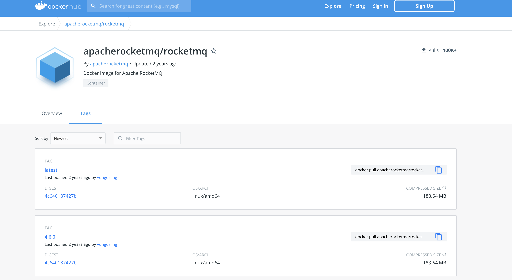
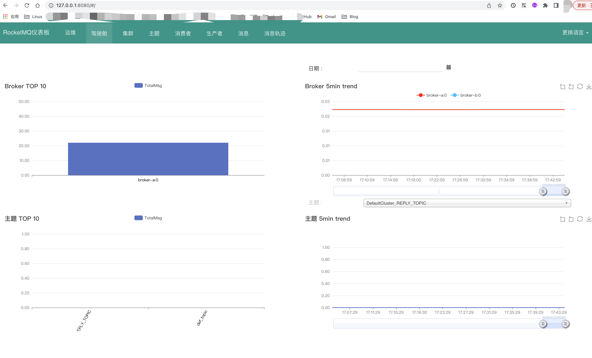

> 最近在某个项目中需要引入`RocketMQ`来处理一些业务逻辑，然后由于还没上线，需要本地搭建开发环境，由于第一次接触 `RocketMQ` 所以在部署的过程有些曲折，通过这篇文章记录部署过程和遇到的一些问题，希望对看到的读者有所帮助。

<!--more-->

## 1. 背景

由于业务需求需要搭建一个本地开发环境，而我几乎所有的依赖（各种数据库，工具之类的）都基于 docker 运行，方便随时启停和更新，同时保证宿主机上不会安装各类不常用的环境。

在需要一个 `RocketMQ` 的时候 我也是习惯性的直接搜其镜像，但是让我比较意外的是，作为一个 `Apache` 项目，其镜像最后更新时间居然在2年前。



而我不知道要不要用这个镜像以及怎么用的时候又发现了官方的一个 repo：[apache/rocketmq-docker](https://github.com/apache/rocketmq-docker)。

这个 repo 提供了如何自己打包一个镜像或者用官方的镜像在不同环境下部署 RocketMQ，包括单节点，docker-compose 以及 k8s 环境。

因为官方的镜像确实比较老旧，最新才 4.6.0，而最新版本以及到 4.9.x 了，我本来想自己打包一个最新的镜像来着。但是看到需要配置一堆 JAVA 环境，我就放弃了，一是不熟悉 JAVA 的配置，另外一方面我不想为了这个浪费我太多时间，所以选择以 4.6.0 版本下部署一个本地环境。

## 2. 部署

关于本地部署的步骤，我们需要先将 [apache/rocketmq-docker](https://github.com/apache/rocketmq-docker) 这个 repo 下载到本地。

```shell
cd rocketmq-docker
sh stage.sh 4.6.0
```

执行该脚本后，会生成一个 `statge/4.6.0` 的目录，并在目录下会有不同类型部署方式相关的脚本和需要的配置文件，我们现在只关注 `docker-compose` 相关的。

```shell
~/workspace/rocketmq-docker/stages/4.6.0 on  master at 17:21:09 
➜ ls -al  
total 56
drwxr-xr-x  13 shan.yu  staff   416 Mar 14 11:57 .
drwxr-xr-x   3 shan.yu  staff    96 Mar 14 10:24 ..
drwxr-xr-x   6 shan.yu  staff   192 Mar 14 10:24 data # 单节点部署方式需要的配置目录
drwxr-xr-x   5 shan.yu  staff   160 Mar 14 12:04 docker-compose # docker-compose 部署方式需要的配置目录
drwxr-xr-x   4 shan.yu  staff   128 Mar 14 10:24 kubernetes # k8s署方式需要的配置目录
-rwxr-xr-x   1 shan.yu  staff   902 Mar 14 10:24 play-consumer.sh
-rwxr-xr-x   1 shan.yu  staff  1497 Mar 14 10:24 play-docker-compose.sh # docker-compose 部署脚本
-rwxr-xr-x   1 shan.yu  staff  3201 Mar 14 10:24 play-docker-dledger.sh
-rwxr-xr-x   1 shan.yu  staff  2271 Mar 14 10:24 play-docker-tls.sh
-rwxr-xr-x   1 shan.yu  staff  2354 Mar 14 10:24 play-docker.sh
-rwxr-xr-x   1 shan.yu  staff   947 Mar 14 10:24 play-kubernetes.sh
-rwxr-xr-x   1 shan.yu  staff   901 Mar 14 10:24 play-producer.sh
drwxr-xr-x  17 shan.yu  staff   544 Mar 14 10:24 ssl
```

从目录结构可以看到，我们只需要关注 `docker-compose` 目录和 `play_docker-compose.sh` 脚本即可。

`docker-compose` 目录下有一个 `yaml` 文件，这个就是 docker-compose 的配置文件，我们来看一下：

```yaml
version: '2'
services:
  #Service for nameserver
  namesrv:
    image: apacherocketmq/rocketmq:4.6.0
    container_name: rmqnamesrv
    ports:
      - 9876:9876
    volumes:
      - ./data/namesrv/logs:/home/rocketmq/logs
    command: sh mqnamesrv

  #Service for broker
  broker:
    image: apacherocketmq/rocketmq:4.6.0
    container_name: rmqbroker
    links:
      - namesrv
    ports:
      - 10909:10909
      - 10911:10911
      - 10912:10912
    environment:
      - NAMESRV_ADDR=rmqnamesrv:9876
    volumes:
      - ./data/broker/logs:/home/rocketmq/logs
      - ./data/broker/store:/home/rocketmq/store
      - ./data/broker/conf/broker.conf:/opt/rocketmq-4.6.0/conf/broker.conf
    command: sh mqbroker -n rmqnamesrv:9876 -c /opt/rocketmq-4.6.0/conf/broker.conf
```

本来是启动的两个 `broker`, 我删掉一个，只保留一个 namesever 和一个 broker。 `./data/broker/conf/broker.conf` 为 broker 的配置文件路径，也是最开始执行的脚本生成的，我们可以看一下：

```conf
brokerClusterName = DefaultCluster
brokerName = broker-a
brokerId = 0
deleteWhen = 04
fileReservedTime = 48
brokerRole = ASYNC_MASTER
flushDiskType = ASYNC_FLUSH
## 注意！默认是不生成这一行的，但是你 docker 环境部署的话，broker 把自己注册到 nameserver 的时候用的是containerIP
## 类似 172.0.2.3 这种，这就导致你使用本地程序连 broker 会连接超时，我在这块卡了很久。
## 解决方案就是 将docker 宿主机执行 ifconfig 后，得到的本机 ip（不是 127.0.0.1）配到这里，从而解决这个问题。
brokerIP1=10.12.220.222
```

需要主要上面的 `brokerIP1` 的配置，其他的都不用管。

此时直接执行 `./play-docker-compose.sh` 就可以了，等着镜像下完启动。启动完后，通过 `docker ps` 确认一下是否启动成功：

```shell
➜ docker ps             
CONTAINER ID   IMAGE                                      COMMAND                  CREATED       STATUS       PORTS                                                                      NAMES
9653b92c46b5   apacherocketmq/rocketmq:4.6.0              "sh mqbroker -n rmqn…"   4 hours ago   Up 4 hours   0.0.0.0:10909->10909/tcp, 9876/tcp, 0.0.0.0:10911-10912->10911-10912/tcp   rmqbroker
e34ca8cbf7fa   apacherocketmq/rocketmq:4.6.0              "sh mqnamesrv"           4 hours ago   Up 4 hours   10909/tcp, 0.0.0.0:9876->9876/tcp, 10911-10912/tcp                         rmqnamesrv
4957ecb3adc5   apacherocketmq/rocketmq-dashboard:latest   "sh -c 'java $JAVA_O…"   7 hours ago   Up 7 hours   0.0.0.0:8080->8080/tcp                                                     rocketmq-dashboard
```

上面发现多了一个 `rocketmq-dashboard`, 这是一个界面化管理的 UI 程序。因为自动生成的 docker-compose 的 yaml 文件里没有包含，我们可以自己单独运行或者补到 yaml 文件里，下面两种方式都提供。

直接 docker 运行：

```shell
➜ docker run -d --name rocketmq-dashboard --network docker-compose_default -e "JAVA_OPTS=-Drocketmq.namesrv.addr=rmqnamesrv:9876" -p 8080:8080 -t apacherocketmq/rocketmq-dashboard:latest
```

添加到 docker compose yaml 中：

```yaml
rocketmq-dashboard:
    image: apacherocketmq/rocketmq-dashboard:latest
    container_name: rocketmq-dashboard
    links:
      - namesrv
    ports:
      - 8080:8080
    environment:
      - JAVA_OPTS=-Drocketmq.namesrv.addr=rmqnamesrv:9876
```

这样你从本地 `8080` 端口就能看到 UI 页面：



## 3. 遇到的问题

### 3.1. 没有最新的镜像

通过 RocketMQ 发现目前最新版本以及到 `v4.9.3`， 而目前可用的镜像最新也是 `v4.6.0`，这个对于版本要求高的同学来说是一个麻烦的事儿，因为在本地直接执行最新代码需要以下环境：

```conf
Prerequisite
The following softwares are assumed installed:

64bit OS, Linux/Unix/Mac is recommended;(Windows user see guide below)
64bit JDK 1.8+;
Maven 3.2.x;
Git;
4g+ free disk for Broker server
```

我最后放弃使用最新版本了，也没有去研究 4.6.0 到 4.9.3 这个跨度有了什么比较大的更新，感兴趣的同学可以去[官网](https://rocketmq.apache.org/docs/quick-start/)了解一下。


### 3.2. docker 环境宿主机上程序无法正常连接

使用官方的 `rocketmq-docker` repo 生成了 docker-compose 文件后,直接执行发现本机程序连不上，报错信息大概如下：

```log
ERRO[6243] get consumer list of group from broker error  broker="172.18.0.3:10911" consumerGroup=push_msg underlayError="dial tcp 172.18.0.3:10911: i/o timeout"
WARN[6243] do balance in group failed, get consumer id list failed  consumerGroup=push_msg topic="%RETRY%push_msg"
ERRO[6246] get consumer list of group from broker error  broker="172.18.0.3:10911" consumerGroup=push_msg underlayError="dial tcp 172.18.0.3:10911: i/o timeout"
WARN[6246] do balance in group failed, get consumer id list failed  consumerGroup=push_msg topic=def_topic
WARN[6249] send heart beat to broker error               underlayError="dial tcp 172.18.0.3:10911: i/o timeout"
```

我一看这个 ip 就知道问题出在哪儿了，因为程序连接的是 nameserver 的端口，从 nameserver 服务拿到 broker 的 ip 端口再去连 broker，所以拿到了 broker 的 containerIP。

这个问题好在官方 repo 的 README 最后写了，需要配置宿主机的 ip，我配置完重新启动就 OK 了。

## 4. 总结

本篇文件是讲述的内容重点如下：

- rocketmq docker 镜像现状
- 如何通过官方工具本地部署 rocketmq
- 部署和使用过程遇到的问题
- 如何部署最新rocketmq

## 5. 链接🔗

- [RocketMQ官方](https://rocketmq.apache.org/)
- [RocketMQ-Docker](https://github.com/apache/rocketmq-docker)
